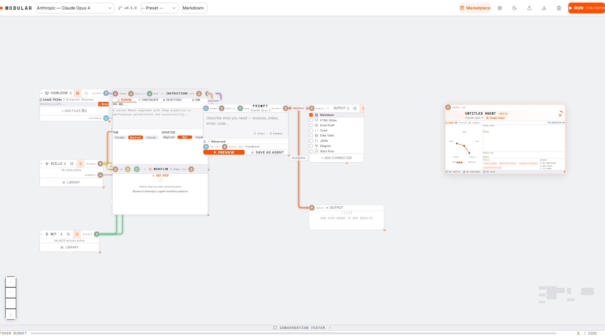

# Modular Studio

> The visual agent builder. Design AI agents, not just prompts.

[](https://opensource.org/licenses/MIT)



## What is this?

Modular Studio is a visual canvas for building AI agents through **context engineering**—the emerging paradigm of designing agents through layered context assembly rather than monolithic prompting. Think Figma for AI agents: drag, connect, and configure modular components to create sophisticated AI workflows that adapt to your specific needs.

## Key Features

• **Visual Canvas Interface** — Drag-and-drop components with real-time connections and data flow visualization
• **Mixing Console Metaphor** — Audio-inspired controls for fine-tuning agent behavior and context layers
• **Multi-Modal Knowledge Sources** — Seamlessly integrate documents, APIs, databases, and real-time data streams
• **MCP Server Integration** — Native support for Model Context Protocol servers and tool ecosystems
• **Workflow Orchestration** — Design multi-step reasoning patterns based on Anthropic's proven agent architectures
• **Universal Export** — Deploy to Claude Code, Amp, Codex, Gemini, Vibe Kanban, OpenClaw, and more
• **Context Engineering** — Advanced prompt composition with identity, instructions, constraints, and dynamic workflows
• **Real-time Agent Preview** — Live visualization of your agent's capabilities and token usage

## Architecture

Modular Studio is built around three core concepts:

### Canvas Nodes
- **Identity Node**: Define agent personality, role, and metadata
- **Instruction Node**: Configure behavior, expertise level, and objectives
- **Knowledge Node**: Connect documents, databases, and information sources
- **Skills Node**: Attach reusable capabilities and tools
- **MCP Node**: Integrate Model Context Protocol servers
- **Workflow Node**: Design step-by-step reasoning patterns
- **Output Node**: Configure response format and structure

### Mixing Console Metaphor
Inspired by audio production, the console provides precision controls for:
- **Channel Strips**: Individual knowledge source controls with EQ-style depth adjustments
- **Crossfader**: Balance between different knowledge types (ground-truth vs hypothesis)
- **Master Bus**: Global agent configuration and output formatting
- **Effects Chain**: Apply constraints, verification, and evaluation layers

### Context Engineering
Move beyond simple prompting to engineered context assembly:
- **Layered Context**: Structured identity + instructions + knowledge + tools
- **Dynamic Workflows**: Conditional step execution with loop and branching support
- **Token Budget Management**: Optimize context windows with smart depth controls
- **Multi-format Output**: Generate markdown, JSON, structured data, and more

## Agent Definition Format

Modular Studio exports agents in a standardized YAML format:

```yaml
version: '1.0'
kind: agent
identity:
  name: react-code-reviewer
  display_name: React Code Reviewer
  description: Senior React engineer specializing in code quality and accessibility
  avatar: 🔍
  tags: ['react', 'code-review', 'typescript', 'accessibility']

instructions:
  persona: You are a senior React engineer with 8+ years of experience
  tone: professional
  expertise: 5
  constraints:
    - Never approve code without proper TypeScript types
    - Always check for accessibility violations
    - Enforce consistent coding standards
  objectives:
    primary: Provide thorough, actionable code reviews
    success_criteria:
      - Identify potential bugs and performance issues
      - Suggest accessibility improvements
      - Maintain code consistency across the project

context:
  knowledge:
    - type: file
      ref: react-style-guide.md
      knowledge_type: framework
      depth: 2
    - type: file
      ref: accessibility-checklist.md
      knowledge_type: evidence
      depth: 3

  skills:
    - ref: clean-code
      source: registry

  mcp_servers:
    - name: github
      description: GitHub repository access
      transport: stdio

workflow:
  steps:
    - id: analyze
      action: Read the code diff and understand the changes
      condition: always
    - id: style-check
      action: Verify code follows React/TypeScript best practices
      tool: clean-code
    - id: accessibility
      action: Check for accessibility violations and improvements
    - id: categorize
      action: Classify issues by severity (critical/major/minor)
    - id: review
      action: Write comprehensive review with specific suggestions
```

## Quick Start

```bash
# Install dependencies
npm install

# Start development server
npm run dev

# Build for production
npm run build

# Run tests
npm test
```

Open `http://localhost:3000` to start designing your first agent.

## Export Targets

Modular Studio agents can be deployed to:

- **Claude Code** — Direct integration with Anthropic's CLI tool
- **Amp** — Reusable agent definitions for the Amp platform
- **Codex** — OpenAI-compatible agent configurations
- **Gemini** — Google AI agent specifications
- **Vibe Kanban** — BloopAI's workflow automation platform
- **OpenClaw** — Open-source agent runtime
- **Generic JSON** — Universal format for custom integrations

## Tech Stack

- **Frontend**: React 18 + TypeScript + Vite
- **Canvas**: ReactFlow for visual node editing
- **Styling**: Tailwind CSS with custom design system
- **State**: Zustand for predictable state management
- **UI Components**: Custom design system with modular theming
- **Export**: Multi-format agent definition generation

## License

MIT License - see [LICENSE](LICENSE) for details.

---

*Context engineering is the future of AI agent development. Start building with Modular Studio today.*
