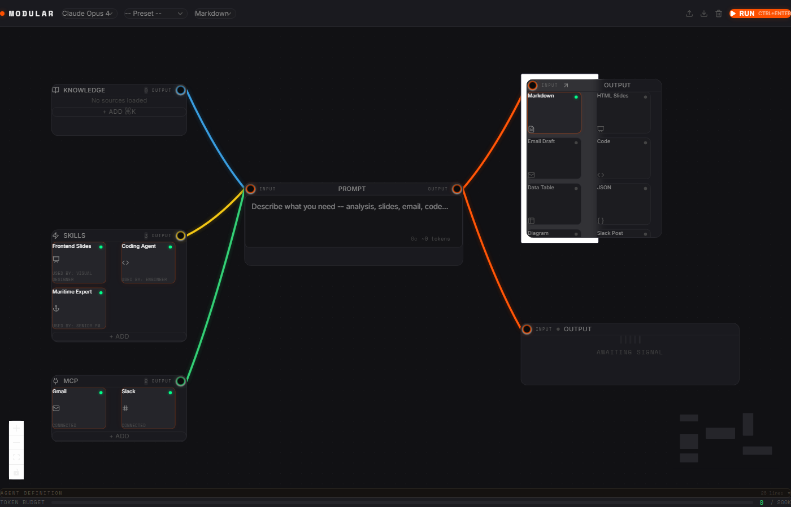

# Modular Studio

**The visual design-time layer for AI agents**

Modular Studio is a visual node-graph builder where you compose AI agents by connecting knowledge sources, skills, MCP tools, and output targets. Design your agent on an interactive canvas, test it with real LLM calls, then export to any runtime — Claude, OpenAI, Codex, AMP, or OpenClaw.



## Quick Start

```bash
# Clone and run
git clone https://github.com/VictorGjn/modular-patchbay.git
cd modular-patchbay && git checkout feat/ui-modernization
npm install
npm run build:all
node dist-server/bin/modular-studio.js --open

# Or (after npm publish)
npx modular-studio
```

The studio opens at `http://localhost:4800`. Use `--port 3000` to change the port.

## Features

- **Visual node-graph canvas** — Drag, connect, and arrange nodes on a React Flow canvas with minimap, zoom controls, and dot-grid background
- **Real LLM integration** — Stream completions from OpenAI, Anthropic, Google AI, OpenRouter, or use the Claude Agent SDK (zero-config if `claude` CLI is authenticated)
- **MCP server management** — Connect MCP servers via stdio transport, discover tools automatically, execute them during agent runs, and monitor health with live status indicators
- **Knowledge system with epistemic types** — Classify sources as Ground Truth, Signal, Evidence, Framework, Hypothesis, or Artifact. Each type carries instructions that shape how the LLM uses that context
- **Depth control** — Dial each knowledge source from Summary → Key Points → Details → Full → Verbatim to control token usage
- **Multi-format output** — Markdown, HTML Slides, Email Draft, Code, CSV, JSON, Diagram, Slack Post — auto-detected from your prompt
- **External connectors** — Read from and write to services (Notion, Google Docs, Slack, Gmail, etc.) via configurable connectors
- **Dark / Light theme** — System-aware with manual toggle
- **Agent export** — Save your agent as a `.md` definition targeting Claude, AMP, Codex, OpenClaw, or a generic format. Download individual targets or all at once
- **Preset system** — Load pre-configured canvas setups to get started quickly
- **Marketplace** — Browse and install skills, MCP servers, and presets from a curated registry
- **Feedback edges** — The agent can suggest new knowledge sources and skills back to their respective nodes for human review

## Architecture

```
Frontend                          Backend
─────────────────────────        ─────────────────────────
React 19 + TypeScript             Express 5
@xyflow/react (React Flow)       @modelcontextprotocol/sdk
Zustand (state management)       Claude Agent SDK
Tailwind CSS 4                   LLM streaming proxy (SSE)
Lucide icons                     MCP Manager (stdio transport)
```

Everything runs locally via a single command:

```
npx modular-studio
    │
    └── Express server (port 4800)
        ├── Serves built React app from dist/
        ├── /api/providers/*   — LLM provider CRUD + connection test
        ├── /api/mcp/*         — MCP server lifecycle + tool discovery
        ├── /api/llm/chat      — Streaming LLM proxy (SSE)
        └── /api/agent-sdk/*   — Claude Agent SDK integration
```

### Canvas Topology

```
Knowledge ─┐
Skills ────┤──→ Prompt (Agent) ──→ Output
MCP Tools ─┘         │              Response
                     │
              Feedback edges
         (enrich knowledge, discover skills)
```

| Cable Color | Meaning |
|-------------|---------|
| Blue `#3498db` | Knowledge → Prompt |
| Yellow `#f1c40f` | Skills → Prompt |
| Green `#2ecc71` | MCP → Prompt |
| Orange `#FE5000` | Prompt → Output / Response |
| Cyan dashed `#00d4ff` | Feedback (Prompt → Knowledge) |
| Yellow dashed | Feedback (Prompt → Skills) |

## Configuration

### LLM Providers

Open **Settings → Providers** to add API keys:

| Provider | Auth | Base URL |
|----------|------|----------|
| Anthropic | `x-api-key` header | `https://api.anthropic.com/v1` |
| OpenAI | Bearer token | `https://api.openai.com/v1` |
| Google AI | API key (query param) | `https://generativelanguage.googleapis.com/v1beta` |
| OpenRouter | Bearer token | `https://openrouter.ai/api/v1` |
| Claude Agent SDK | Zero-config | Requires `claude` CLI authenticated |

You can also add custom providers with any OpenAI-compatible endpoint.

### MCP Servers

Configure MCP servers in **Settings → MCP Servers** or install them from the **Marketplace**. Each server connects via stdio transport and exposes tools that appear in the MCP node on the canvas.

### General Settings

- **Theme**: System / Light / Dark
- **Edge routing**: Straight or smoothstep
- **Grid snap**: Toggle snap-to-grid
- **Minimap**: Show/hide the minimap overlay

## Models

The Prompt node supports these models out of the box:

- Claude Opus 4, Claude Sonnet 4
- GPT-4o, GPT-4o Mini
- Llama 3.1 70B
- DeepSeek V3
- Gemini 2.5 Pro

Select your model in the Prompt node's **Advanced** drawer, or from the Topbar dropdown.

## Contributing

1. Fork the repo
2. Create a feature branch (`git checkout -b feat/my-feature`)
3. Run the dev server: `npm run dev` (frontend on `:5173`) + `npm run server` (backend on `:4800`)
4. Make your changes
5. `npm run build:all` to verify the production build
6. Open a PR

## License

MIT
